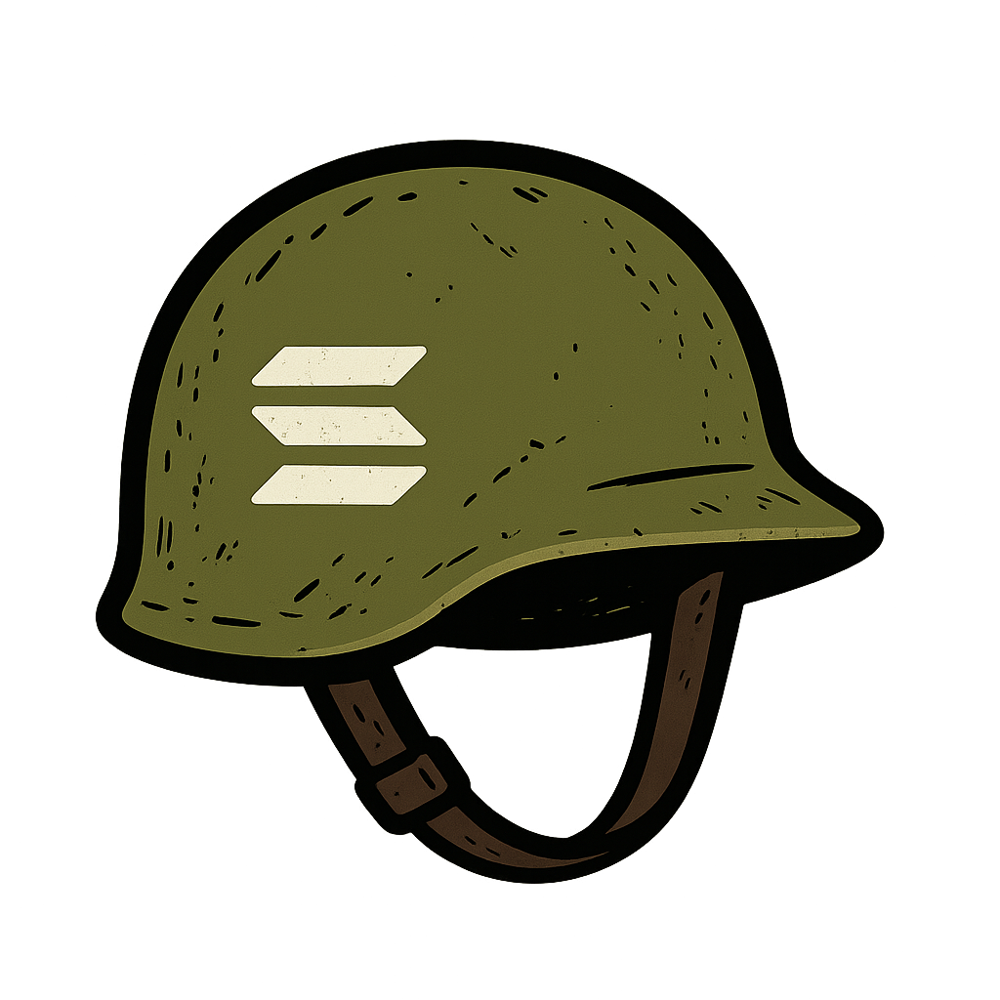

# NoRug.fun

  

## 🎯 Context & Motivation

The Solana ecosystem has seen significant buzz, notably with the rise of platforms like [Pump.fun](https://pump.fun/) that have drawn capital and attention to meme coins. However, this rapid growth comes with challenges.

Established platforms like Raydium, with its "Launchlab," have attempted to structure token launches, but concerns remain regarding distribution transparency, the excessive creation of tokens, and dynamics that can sometimes extract value from the ecosystem rather than strengthen it.

**NoRug.fun** aims to offer a fairer, more transparent, and community-driven alternative for launching new tokens on Solana.

## 💡 Vision & How It Works

Our vision is to create a platform where token ideas can be proposed and backed by the community before their official launch, ensuring a fair and secure mechanism.

The process unfolds in two main phases:

### Phase 1: The Founder Window

1.  **Proposal (Founder):**
    *   A creator proposes a token idea.
    *   They define the name, symbol, and total supply.
    *   They set the percentage of the supply they will receive (max 10%) and a lock-up period for their own tokens.
2.  **Support (Co-Founder):**
    *   Users (co-founders) browse active proposals.
    *   They can support a proposal by investing SOL into it.
3.  **Selection:**
    *   At the end of a defined period (epoch), proposals are ranked based on the SOL raised.
    *   The **top 10 proposals** are selected to move to the next phase.

### Phase 2: Launch & Market

1.  **Creation & Distribution:**
    *   For the 10 winning proposals, NoRug.fun automatically handles:
        *   The token **mint**.
        *   The **distribution** of tokens to the creator (according to their defined %) and to the co-founders (proportionally to their SOL investment).
    *   The initial liquidity pool is created on a DEX (via Meteora) using the SOL raised during Phase 1.
2.  **Reclaim:**
    *   Users who invested in **non-selected** proposals (outside the Top 10) can **reclaim their full SOL investment**.
3.  **Open Market:**
    *   The newly launched tokens are now tradable on the secondary market like any other Solana token.

## ✨ Key Features (Implemented or Planned)

*   **Epoch Management:** Smart contract to manage proposal cycles (opening, closing).
*   **Proposal & Support Accounts:** Secure on-chain structures to store proposal details and user investments.
*   **Secure Vault:** Temporary storage of invested SOL via program-controlled PDAs.
*   **Ranking & Finalization Logic:** Off-chain service (crank) to determine winners and update on-chain statuses via a secure authority.
*   **Liquidity Management:** Planned integration with Meteora for pool creation.
*   **Intuitive User Interface:** Front-end (Next.js) to propose, browse, support, and (soon) reclaim funds/tokens.
*   **Wallet Integration:** Support for major Solana wallets (Phantom, Solflare via Wallet Adapter).
*   **(Backend Service - upcoming)**: Likely Node.js/TypeScript for the 'crank' service.

## 🛠️ Technologies 💻

*   **Solana**: High-performance blockchain.
*   **Anchor**: Development framework for Solana programs (Rust).
*   **Rust**: Language for on-chain development.
*   **Next.js**: React framework for the front-end (App Router).
*   **TypeScript**: Typed superset of JavaScript.
*   **Tailwind CSS / Shadcn UI**: For styling and UI components.
*   **Next Intl**: Internationalization.

## 🛠️ Installation & Local Setup

*(Keep or adapt existing instructions here if present and correct)*

1.  Clone the repository.
2.  Install root dependencies (`npm install` or `yarn`).
3.  Navigate to `programs/programs` and build the Anchor program (`anchor build`).
4.  Deploy to a local validator (`anchor deploy`).
5.  (If necessary) Run the initialization script (e.g., for `initialize_program_config`).
6.  Navigate to `front` and install dependencies (`npm install` or `yarn`).
7.  Run the front-end development server (`npm run dev` or `yarn dev`).

## Credits 👨‍💻

**[Alexandre Bourdois](https://github.com/alexandre-bourdois)**, **[Alexandre Kermarec](https://github.com/alexlakarm)**, **[Pierre-Yves Lejeune](https://github.com/pylejeune)**: Project creators as part of the [Colosseum Breakout Hackathon](https://www.colosseum.org/breakout).